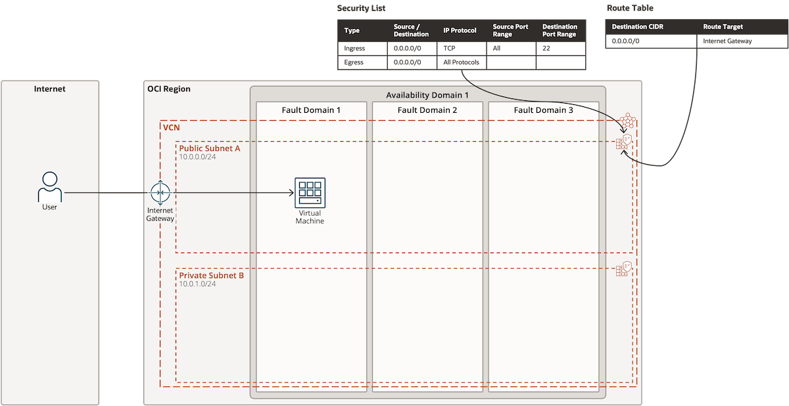

# 데이터 3법, 마이데이터 사업

## 데이터 3법 개정 배경

* 양질의 데이터가 사업 성공의 핵심 요소
* 데이터 관리/활용에 대한 법적 근거 마련
* 안전한 데이터 이용, 개인정보 자기 결정권 강화 제도

## 데이터 3법 주요 개정 내용

<table><thead><tr><th width="194"></th><th></th></tr></thead><tbody><tr><td>개인정보보호법</td><td>개인정보보호 법령 및 체계 정비</td></tr><tr><td></td><td>개인정보 범위의 합리적 판단기준 제시</td></tr><tr><td></td><td>가명정보 도입으로 데이터 활용 제고</td></tr><tr><td></td><td>타당한 목적, 범위 내 개인정보 활용 범위 확대</td></tr><tr><td>정보통신망법</td><td>개인정보보호체계 일원화</td></tr><tr><td>신용정보법</td><td>마이데이터 산업 도입</td></tr><tr><td></td><td>빅데이터 분석 활용의 법적 근거 마련</td></tr><tr><td></td><td>개인정보 자기 결정권 도입</td></tr></tbody></table>

## 마이데이터 사업

<figure><figcaption></figcaption></figure>

* 개인이 개인정보 자기 결정권을 기반으로 개인정보 활용처, 활용범위에 능동적으로 의사 결정 및 권한 행사하도록 개인정보 이용/관리/열람 서비스 제공 사업

## 마이데이터 사업 활성화 방안

1. 의료, 교육, 유통등 산업 영역별 전담기관 구성
2. 마이데이터 관련 사업 지원 확대
3. 데이터 전산화 및 표준화
4. 보안기술 연구 지원
5. 기존 추진 서비스 개선 사항 수렴 및 반영
6. 산업 생태계 조성
