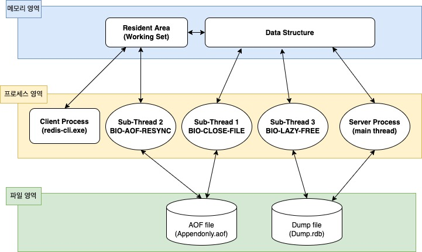

# 🎏 Thread

## THREAD/IO

version ≥ 6.0  : multi-threaded i/o 추가 

* i/o 소켓 Multi Thread
  * <mark style="color:blue;">사용자 명령이 Multi Thread 된다</mark>
* sub thread 4 (jemalloc background thread )

| 조건               | 설정값                | 설명   |
| ---------------- | ------------------ | ---- |
| 기본값              | io-thread : 1      | 비활성화 |
| if cpu.core >= 4 | io-thread : 2 or 3 | 활성화  |
| if cpu.core >= 8 | io-thread : 6      | 활성화  |

version ≥ 4.0  : 4개 Thread 사용

* main thread : 명령어 처리, 이벤트 처리
* sub thread 1 (bio\_close\_file) : aof 가 쓰는 file을 쓰고 닫기 관리
  * aof 사용 안해도 쓰레드 생성됨
* sub thread 2 (bio\_aof\_fsync) : 1초 마다 aof 쓰는 작업.
* sub thread 3 (bio\_lazy\_free) : unlink, async flushall, flushdb 같은 명령어 처리

→ \[결론] : 응..싱글 쓰레드\~

→ 확인 방법 `$ ps -eLf | **grep** "redis"`

<figure><figcaption></figcaption></figure>

### 요약

Redis는 영속성을 위해, 명령어 실행은 기본적으로 단일 스레드이다. 

* 6.0 버전 부터, Thread/IO가 적용되어
  * <mark style="color:blue;">명령어 실행을 Read/Write로 구분하여 별도 스레드 구성이 가능하다.</mark>
* 4.0 버전 부터,  IO 엑세스를 별도 스레드로 진행하도록 변경되었다.
* 3.0 버전 부터,  AOF 백그라운드 처리를 위한 Sub Thread가 추가되었다.

## :white\_check\_mark: Single Thread 이어도, 일을 잘하는 이유

* 스레드간의 자원 공유 문제에서 자유롭다.
* 명령어 작업을 커널 i/o 레벨에서 Multiplexing 을 통해 처리하여 동시성을 보장한다 \
  ( = 커널 i/o 입장에서는 Multi 스레드 처럼 쓰는거다! )

<figure><figcaption></figcaption></figure>

## Ref

* [http://www.zdnet.co.kr/view/?no=20131119174125](http://www.zdnet.co.kr/view/?no=20131119174125)

