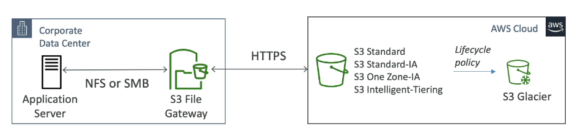

# Istio

Kubernetes Istio : 완벽 실습 과정

* [https://github.com/DickChesterwood/istio-fleetman](https://github.com/DickChesterwood/istio-fleetman)

## 구성요소

<figure><figcaption></figcaption></figure>

1. Kiali : 연결 관리 툴
2. <mark style="color:red;">Envoy</mark> : Proxy
3. Citadel :&#x20;
   * 서비스 사용을 위한 인증/인가 담당
   * TLS 통신 사용, Certification 관리
4. Gallery :&#x20;
   * 설정 관리
5. <mark style="color:red;">Pilot</mark> : Envoy 생명주기 담당 및 다른 인스턴스  정보 전달
   * Envoy Sidecar을 위한 Service Discovery 제공
   * Platform Adapter&#x20;
     * 새로운 인스턴스가 생성되면, Platform Adapter에게 알림
     * 그럼 envoy proxy 들에게 알림

## Install&#x20;

[https://istio.io/latest/docs/setup/getting-started/#download](https://istio.io/latest/docs/setup/getting-started/#download)&#x20;

```
curl -L https://istio.io/downloadIstio | sh -
cd istio-1.22.3
cp -v ./bin/istioctl /usr/local/bin
```

특정 버전 다운로드

```
curl -sL https://istio.io/downloadIstioctl | ISTIO_VERSION=1.10.3 TARGET_ARCH=x86_64 sh -
```


```
istioctl install istio-operator.yaml
```


```
apiVersion: install.istio.io/v1alpha1
kind: IstioOperator
metadata:
  namespace: istio-system
  name: istiocontrolplane
spec:
  profile: default
  components:
    egressGateways:
    - name: istio-egressgateway
      enabled: true
      k8s:
        hpaSpec:
          minReplicas: 2
    ingressGateways:
    - name: istio-ingressgateway
      enabled: true
      k8s:
        hpaSpec:
          minReplicas: 2
    pilot:
      enabled: true
      k8s:
        hpaSpec:
          minReplicas: 2
  meshConfig:
    enableTracing: true
    defaultConfig:
      holdApplicationUntilProxyStarts: true
    accessLogFile: /dev/stdout
    outboundTrafficPolicy:
      mode: REGISTRY_ONLY
```

### Istio Profile

* default
* demo

### Istio Operator

istio설정을 file로 관리하는 기능을 제공하고 있으며, 이것을 istio Operator라고 부릅니다.


## Envoy Proxy

<figure><figcaption></figcaption></figure>

* Envoy Proxy로 구성된 Data Plane을 컨트롤 하는 것이 Istio이다.


<figure><figcaption></figcaption></figure>


Ref&#x20;

* [https://dramasamy.medium.com/life-of-a-packet-in-istio-part-1-8221971d77de](https://dramasamy.medium.com/life-of-a-packet-in-istio-part-1-8221971d77de)
*
